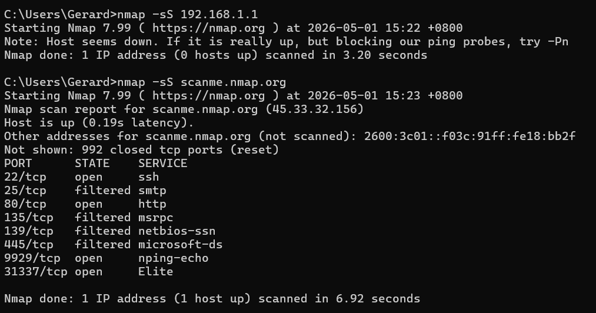

# nmap-network-scan
network scanning and port analysis using nmap

Nmap Network Scan Lab
Objective
-To perform network scanning and identify open ports and services on a local network.

Tools Used
-Nmap

Steps Performed
1.Installed Nmap on Windows
2. Ran a TCP SYN scan on the local router:
    -nmap -sS 192.168.1.1
3. Identified open ports and services
4. Analyzed potential security risks

Findings
-Port 80 (HTTP) was open
-Port 443 (HTTPS) was open
These ports indicate a web interface is accessible

Screenshot

Security Risks Identified

-Open HTTP port (80) may transmit data in plaintext, making it vulnerable to interception (e.g., packet sniffing via Wireshark)
-Exposed web interface could be targeted for brute-force or credential-based attacks
-If default credentials are used, device compromise is possible

Summary 

-The scan successfully identified exposed services on the network. Open web ports indicate a potentially accessible administrative interface, 
which could be exploited if not properly secured. Implementing HTTPS-only access, strong authentication, and restricting access via 
firewall rules would reduce the attack surface.
